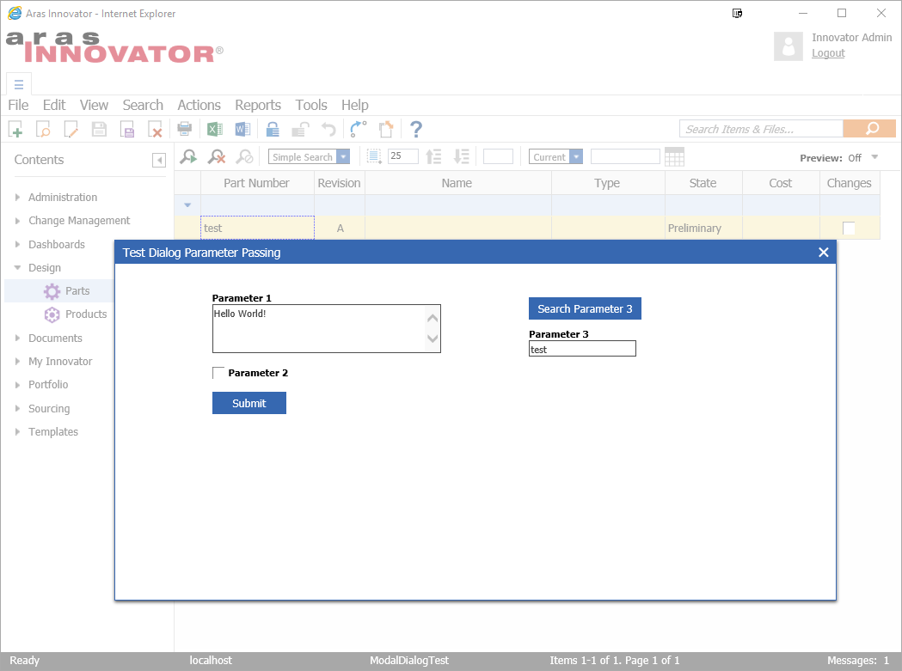
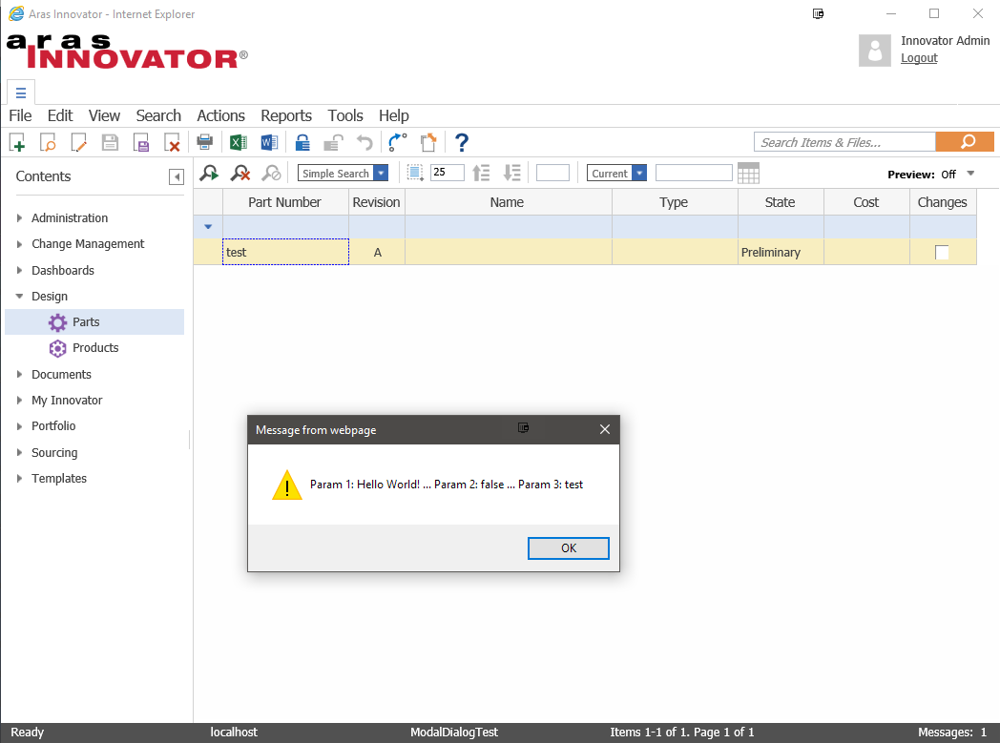

# Custom Modal Dialog Sample

The Custom Modal Dialog project contains an import package that provides sample code for calling a custom Aras form in a modal dialog. The sample code also shows how data can be passed from the custom form back to the calling method.

## History

This project and the following release notes have been migrated from the old Aras Projects page.

Release | Notes
--------|--------
[v2.2](https://github.com/ArasLabs/custom-model-dialog/releases/tag/v2.2) | Added field to demonstrate use of search dialog. Clicking the "Search Parameter 3" button programmatically calls the default Aras search dialog. Allows the user to search for a Part and populate the "Parameter 3" field with their selection.
[v2.1](https://github.com/ArasLabs/custom-model-dialog/releases/tag/v2.1) | Removed item_info from dialog form
[v2.0](https://github.com/ArasLabs/custom-model-dialog/releases/tag/v2.0) | Updated to work with the Aras 11.0 SP9+ tabbed client.
[v1.0](https://github.com/ArasLabs/custom-model-dialog/releases/tag/v1.0) | First release. Though built and tested using Aras 11.0 SP7, this project may function in older releases of Aras 11.0 and Aras 10.0.

#### Supported Aras Versions

Project | Aras
--------|------
[v2.2](https://github.com/ArasLabs/custom-model-dialog/releases/tag/v2.2) | 11.0 SP9
[v2.1](https://github.com/ArasLabs/custom-model-dialog/releases/tag/v2.1) | 11.0 SP9
[v2.0](https://github.com/ArasLabs/custom-model-dialog/releases/tag/v2.0) | 11.0 SP9
[v1.0](https://github.com/ArasLabs/custom-model-dialog/releases/tag/v1.0) | 11.0 SP7

## Installation

#### Important!
**Always back up your code tree and database before applying an import package or code tree patch!**

### Pre-requisites

1. Aras Innovator installed (version 11.0 SPx preferred)
2. Aras Package Import tool
3. Custom Modal Dialog import package

### Install Steps

1. Backup your database and store the BAK file in a safe place.
2. Open up the Aras Package Import tool.
3. Enter your login credentials and click **Login**
    * _Note: You must login as root for the package import to succeed!_
4. Enter the package name in the TargetRelease field.
    * Optional: Enter a description in the Description field.
5. Enter the path to your local `..\CustomModalDialog\Import\imports.mf` file in the Manifest File field.
6. Select **aras.labs.CustomModalDialog** in the Available for Import field.
7. Select Type = **Merge** and Mode = **Thorough Mode**.
8. Click **Import** in the top left corner.
9. Close the Aras Package Import tool.

You are now ready to login to Aras and try out a custom modal dialog.

## Usage

1. Login to Aras.
2. Navigate to **Design > Parts** in the table of contents (TOC).
3. Right click on a Part item in the main grid and select **Open Custom Modal Dialog**.
4. Enter some text into the Parameter 1 field.
    * Optional: Select the Parameter 2 checkbox.
    * Optional: Click the **Search Parameter 3** button and choose a Part item for the Parameter 3 field.
5. Click **Submit**.

The modal dialog will close and an alert will appear, showing the values of param1, param2, and param3 that were returned by the modal dialog.

## Contributing

1. Fork it!
2. Create your feature branch: `git checkout -b my-new-feature`
3. Commit your changes: `git commit -am 'Add some feature'`
4. Push to the branch: `git push origin my-new-feature`
5. Submit a pull request :D

For more information on contributing to this project, another Aras Labs project, or any Aras Community project, shoot us an email at araslabs@aras.com.

## Credits

Created by Eli Donahue for Aras Labs. @EliJDonahue

Contributions by:
* @AngelaIp
* @mptap

## License

Aras Labs projects are published to Github under the MIT license. See the [LICENSE file](./LICENSE.md) for license rights and limitations.
